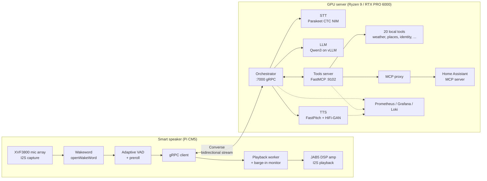

# ai-orchestrator

A fully local voice assistant: a custom smart speaker built on a Raspberry Pi CM5 talks to a GPU server over one bidirectional gRPC stream. Speech recognition, the language model, tool calling, and speech synthesis all run on hardware in the house. Nothing in the audio path touches a cloud API.

This repository is a sanitized snapshot of a personal project, published as a reference for how I design and build systems. It is not packaged for reuse; there is no one-command install. What it does show is a working end-to-end system with the tradeoffs left visible: streaming everywhere, barge-in, per-speaker identity, an MCP tool plane with authorization boundaries, and observability from the first commit.

Author: Ian Bennett ([github.com/ianisms](https://github.com/ianisms)). MIT licensed.

## What is here

| Path | What it is | Size |
|---|---|---|
| `server/` | GPU server: gRPC orchestrator, MCP tools server and proxy, custom TTS service, Docker Compose stack with Prometheus, Grafana, and Loki | ~13k lines Python |
| `speaker/` | Pi CM5 voice client (wakeword, VAD, capture, playback, barge-in), device tree overlay, bring-up scripts, custom KiCad carrier board, 3D-printed enclosure | ~4k lines Python, plus hardware sources |
| `docs/` | Design notes with file references | |

Everything in `server/` is Python 3.11 with `asyncio`, gRPC, FastMCP, FastAPI, and NVIDIA NeMo. The speaker client is Python on Raspberry Pi OS in a Docker container with ALSA passthrough. Hardware sources are KiCad 9 and STEP.

## Architecture

One turn, end to end: the speaker hears the wakeword, plays a chime, and streams 16 kHz PCM frames to the orchestrator. The orchestrator forwards audio to the STT service as it arrives and starts a speculative LLM call on partial transcripts. When the utterance commits, the LLM streams a reply, possibly with tool calls that are validated locally, dispatched in parallel over MCP, and folded back into a second low-temperature synthesis pass. Reply text is sanitized for speech and streamed to the TTS service, which returns PCM that the orchestrator relays to the speaker in chunks. If the user talks over the reply, the speaker detects it, sends `Cancel`, and the server tears down TTS mid-stream.

## Things worth reading

These are the parts I would point a reviewer at first. `docs/design-notes.md` has the full list with file references.

**Audio never crosses the tool protocol.** Speaker identification needs the turn's audio, but base64-encoding seconds of PCM through JSON-RPC is the wrong shape. Instead the orchestrator wraps the STT input queue in a duck-typed `AudioTapQueue` that records frames in passing, writes a WAV on commit, and injects an opaque `[AUDIO_REF session_id audio_id]` into the prompt. The identity tool reads the file from a shared mount. Zero copy on the hot path, and the reference is bound to this turn so it cannot be replayed. (`server/modules/orchestrator/core/audio_tap.py`)

**Authorization boundaries the model cannot cross.** Two kinds of state are scoped by values the LLM never supplies: `client_id` for per-device preferences comes from the gRPC peer, and person identity comes from the current turn's audio. The MCP proxy enforces per-upstream `allowed_tools` and `denied_tools` (deny wins), namespaces upstream tools as `server__tool` so nothing collides, and unregisters a server's tools when its liveness ping fails so the model never sees a tool it cannot call. Tool arguments are validated against JSON Schema locally before dispatch; unknown tool names are dropped, not called. (`server/tools_server/mcp_proxy.py`, `server/modules/orchestrator/core/utterance.py`)

**Hot reload propagated end to end.** Save a tool file on the server and the LLM's tool list updates without restarting anything: `watchfiles` triggers an unregister-then-reload in the tools server, which pushes a `ToolListChangedNotification` to every live MCP transport, which the orchestrator's client picks up and refreshes asynchronously. (`server/tools_server/loader.py`, `server/modules/orchestrator/tools/mcp_client.py`)

**Upstream MCP schemas rewritten from YAML.** Home Assistant's MCP tool descriptions were written for a chat UI, not a voice model that has to pick `name` vs `area` vs `floor` in one shot. `mcp-servers.yaml` overrides descriptions and entire parameter schemas per upstream tool without forking the upstream server, and stamps provenance into tool metadata. The proxy also carries a transport subclass because Home Assistant needs `POST` for its SSE stream. (`server/tools_server/mcp-servers.yaml`, `server/tools_server/mcp_proxy.py`)

**Degrade before evict.** Under session pressure the orchestrator shrinks every session's history token budget rather than dropping conversations, and only hard-evicts LRU above a separate 1.25x cap. The budget itself is negotiated from the model's real `max_model_len` at startup; config can lower it but never overflow the context. (`server/modules/aiserver/server.py`)

**Barge-in on both ends.** Server side, any inbound audio frame while `SPEAKING` sets an `asyncio.Event` that doubles as the TTS cancel token. Client side, a dedicated VAD instance watches the mic only during playback, with a stale-queue drain and a 600 ms chime-bleed guard so it does not trigger on its own output. The client also has a documented late-cancel path: the receive loop polls the cancel event because the transmit task has already exited after end-of-utterance. (`speaker/modules/speaker/capture_streamer.py`, `speaker/modules/speaker/grpc_client.py`)

**Three queues, three overflow policies.** Inbound audio and text drop oldest. The outbound queue evicts oldest and records which message kind was sacrificed. On the speaker, the `control` event topic is deliberately unbounded while telemetry topics drop, because losing a wakeword or barge-in event is unacceptable and losing a stats event is not. (`server/modules/aiserver/server.py`, `speaker/modules/speaker/events_bus.py`)

**Prosody-aware TTS streaming.** The TTS service chunks on sentence boundaries, merges tiny trailing fragments backwards because they synthesize badly, crossfades chunks with an equal-power window, and inserts real silence at sentence ends. Text normalization runs under a 150 ms budget and falls back to raw text, so it is never a latency floor. A single GPU lock serializes synthesis because the LLM, STT, and TTS share one card. (`server/tts/server/`)

**Proto drift is a warning, not a mystery.** The server hashes its own `.proto` at startup and exchanges the SHA in gRPC metadata. Skew between the Pi and the server shows up as one log line instead of a deserialization bug three layers down. (`server/modules/aiserver/server.py`)

## Hardware

The speaker is a Raspberry Pi CM5 on a custom carrier board (`speaker/hardware/pcb/theboard/`, KiCad, revision 3.7) with an XMOS XVF3800 four-mic array capturing over I2S and a Wondom JAB5 (ADAU1701 DSP) amplifier playing back over the same bus. The Pi is bitclock and frame master for both; a single device tree overlay (`speaker/overlays/xvf3800-jab5-i2s.dts`) exposes them as one ALSA card with capture and playback. Power is an internal Mean Well 28 V supply with a captive AC cord. The enclosure (`speaker/enclosure/`) is 3D printed with a wood veneer wrap; STEP solids and the build guide are included.

`speaker/README.md` has the wiring table, power architecture, and bring-up sequence.

## Running it

This is not turnkey, but the pieces are all here. The server expects an NVIDIA GPU with enough VRAM for the three inference services, Docker with the NVIDIA container toolkit, and model weights placed under `/ai/server/` as documented in `server/README.md`. Copy `server/.env.example` to `.env` and fill in the API keys for whichever tools you enable. `docker compose up` in `server/docker/` brings up the stack with health-gated dependency ordering.

The speaker client is built and deployed with `speaker/scripts/build_pi_release.sh` and `deploy_pi_release_wsl.sh`; see `speaker/README.md`.

## What was removed for publication

Secrets were never committed, but the following were stripped or generalized: LAN addresses and hostnames, personal contact details and example locations, the local model directory name, the system prompt persona, AI coding-assistant session files, an earlier generation of the speaker client, PCB revisions 3.5 and 3.6, fabrication order files, and large generated artifacts (STEP exports of the PCB, footprint caches). The custom TTS voice model, the custom wakeword model, and their training data are not included; the wakeword config defaults to a public openWakeWord model. Git history was not carried over.

## Author

Ian Bennett is a principal engineer and architect with 27 years in software, most recently at Microsoft on Azure Identity Governance and Azure Customer Lockbox. This project is where the identity and authorization thinking from that work meets a soldering iron.
