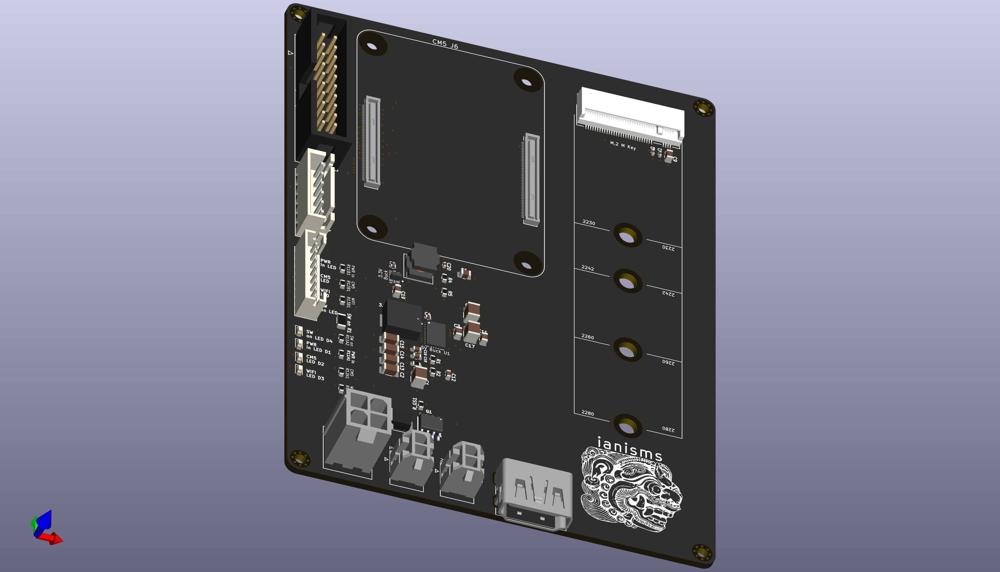
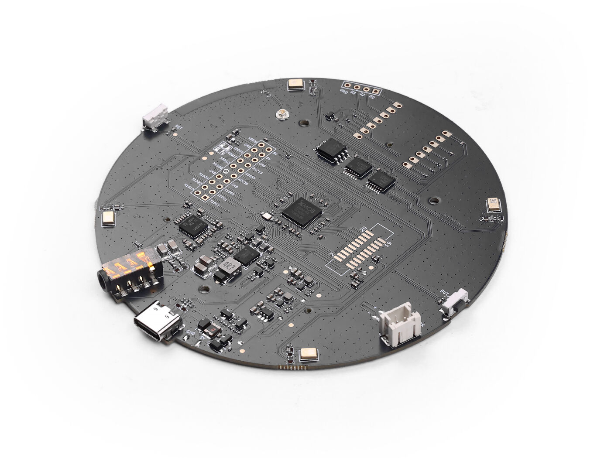
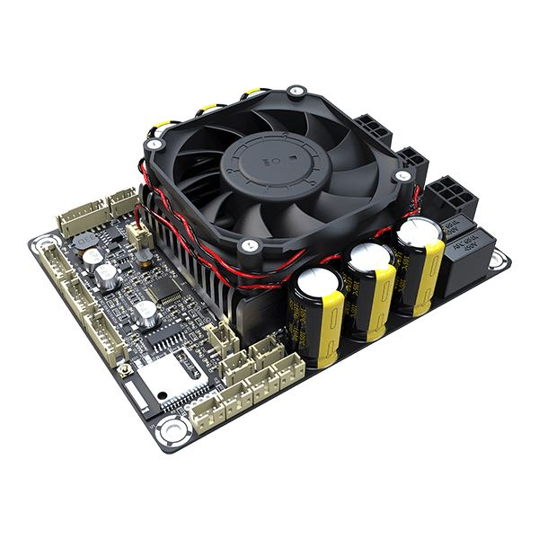

# Smart speaker

Voice client and hardware for a fully local voice assistant. A Raspberry Pi Compute Module 5 on a custom carrier board captures audio from an XMOS XVF3800 mic array over I2S, streams it to the AI server over gRPC, and plays the reply through a Wondom JAB5 DSP amplifier on the same I2S bus. There is no cloud dependency anywhere in the audio path.

## Voice flow

1. The client listens continuously for a wakeword with openWakeWord. The deployed unit uses a custom phrase trained with the [openWakeWord training notebook](https://github.com/dscripka/openWakeWord#training-new-models); that model is not included, and `wake_model_path` defaults to the bundled `hey_jarvis` model, which `docker/oww_bootstrap.py` downloads at image build.
2. On wake it plays a chime and begins streaming the utterance. A pre-roll buffer keeps the audio from just before the wake event so the first syllable is not clipped.
3. Energy-based adaptive VAD gates the stream. Capture ends on sustained silence, or early when the server reports `THINKING` or sends the first TTS chunk.
4. The server streams `Transcript`, `Reply`, and `TtsAudio` back. Audio is queued to a playback worker and written to ALSA from a dedicated thread.
5. During playback a separate barge-in monitor watches the mic. Sustained speech cancels playback, sends `Cancel` upstream, and starts a new turn with the interrupting audio as its pre-roll.
6. After the reply the client can optionally hold a follow-up window (`followup_enable`) and return to idle on silence.

## Software (`modules/speaker/`)

| File | Role |
|---|---|
| `orchestrator.py` | Wires seven supervised tasks with exponential-backoff restart; `tee_mic()` fans mic frames out to the wakeword, utterance, and barge-in queues and holds the echo suppression and playback-guard policy |
| `capture_streamer.py` | Turn capture: drain, settle, VAD-gated `mic_iter`, barge-in monitor, playback backpressure |
| `grpc_client.py` | Persistent `Converse` stream, reconnect with backoff, early transmit stop, late-cancel path |
| `vad.py` | RMS VAD with adaptive threshold, noisy-room ceiling, persisted noise floor |
| `audio_capture.py`, `audio_playback.py`, `playback_worker.py` | ALSA capture and playback, threaded writer, out-of-order chunk stash |
| `wake_listener.py`, `wakeword_loop.py` | openWakeWord scoring and chime |
| `events_bus.py`, `state_machine.py` | Topic pub/sub with per-topic overflow policy; guarded state transitions |
| `config.py`, `reload.py` | Flat config dataclass with unknown-key warnings and named benchmark profiles; hot restart on file change |

Configuration is `config/config.yaml` with `config/benchmarks.yaml` supplying `latency`, `balanced`, `robust`, and `noisy` profiles. The Docker image (`docker/`) pins gRPC and protobuf, generates the stubs at build time, and pre-downloads the openWakeWord base models so a Pi with no network still boots.

`test/test_speaker_integration.py` covers VAD calibration persistence, speech-versus-silence detection, state machine guards, and event bus isolation with synthesized PCM. `test/chat_client.py` is a text-mode client for the server. `scripts/test/oww/testit.py` is a standalone wakeword bench.

## Hardware

### Components

| Component | Role |
|---|---|
| Raspberry Pi CM5 | Compute; I2S bitclock and frame master |
| Custom CM5 carrier board (`hardware/pcb/theboard/`, rev 3.7) | Replaces the Geekworm X1500 and separate breakouts. Internal 28 V input, 5 V and 3.3 V rails, PCIe to M.2 NVMe, 40-pin GPIO, 2x10 ribbon header to the mic array, JST I2S link and Micro-Fit power to the amplifier |
| Seeed reSpeaker XVF3800 (XMOS, non-ESP32 variant) | Four-mic array with beamforming, flashed with XMOS I2S firmware, I2S slave on capture |
| Wondom JAB5 (AA-JA33286, ADAU1701 DSP) | I2S slave on playback, Class D amplifier with DSP limiter |
| Mean Well LRS-150-28 | Internal AC-DC supply, captive AC cord, no user-facing connectors |
| Dayton RS100-4 and RS125-4 | Active driver (top) and passive radiator (bottom) |

`hardware/pcb/theboard/specs.md` is the design brief with the power tree, budget, sequencing, headers, and stackup. The KiCad schematic, board, design rules, DRC report, and JLCPCB gerbers for rev 3.7 are included. Earlier revisions are not.

### I2S wiring

| Signal | Pi GPIO / pin | XVF3800 | JAB5 |
|---|---|---|---|
| BCLK | GPIO18 / pin 12 | X0D37 | pin 2 |
| LRCLK | GPIO19 / pin 35 | X0D38 | pin 1 |
| Pi to DAC data | GPIO21 / pin 40 | | pin 3 |
| Mic to Pi data | GPIO20 / pin 38 | X1D00 | |
| MCLK | not used | not used | not used |

All grounds are common. No clock cross-wiring between the two slaves.

### Device tree overlay

`overlays/xvf3800-jab5-i2s.dts` enables the Pi I2S block as clock producer and declares the XVF3800 as a capture codec (`linux,spdif-dir`) and the JAB5 as a playback codec (`linux,spdif-dit`) on one `simple-audio-card` named `XVF3800-JAB5`. No generic or dummy codecs, no MCLK, no HAT EEPROM. The header comments give the `dtc` compile and `config.txt` install steps.

`xvf3800/` holds the bring-up scripts and notes, including two earlier overlay approaches that were tried before settling on the single duplex overlay.

### Enclosure

`enclosure/guide/guide.md` is the print and assembly guide for revision 16: a 150 mm by 282 mm PETG-CF cylinder, about 1.7 L sealed, passive radiator tuned near 65 Hz, hex vent clusters top and bottom, and an optional veneer wrap. `enclosure/steps/` has the STEP solids for the body, grille, lens, and full assembly. `guide/gen_images.py` renders the cut diagrams.

## Deployment

`scripts/build_pi_release.sh` assembles a release tree; `scripts/deploy_pi_release_wsl.sh` provisions an SD card from WSL, and `scripts/install_pi_release.ps1` mounts the card's partition on Windows so WSL can write it. Set `PI_USER` and `SSH_PUB` for your environment. On the Pi the client runs as a Docker container (`docker/docker-compose.yaml`) with `/dev/snd` passed through. `server_target` in `config/config.yaml` points at the AI server.

## Non-goals

USB audio, HAT EEPROM, MCLK-based designs, generic or dummy codecs, and replacing I2S with USB were all considered and rejected. The point of the design is one I2S bus with the Pi as master and two purpose-built slaves.
