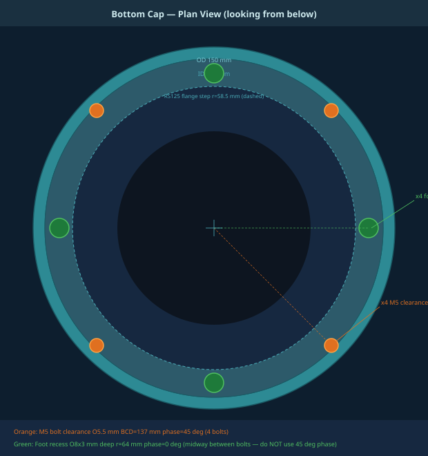
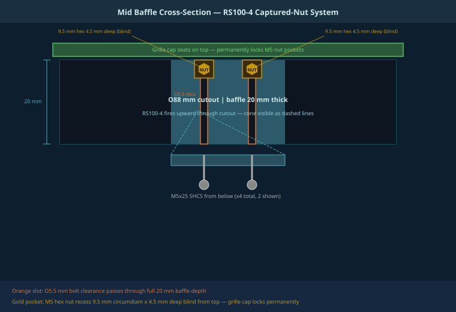
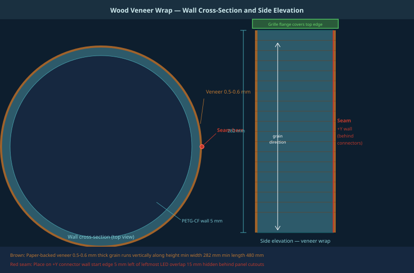

# CM5 Smart Speaker Enclosure
## Printing & Assembly Guide — Revision v16

**Enclosure:** Cylindrical PETG-CF · OD 150 mm · H 282 mm · ~1.7 L sealed  
**Compute:** Raspberry Pi CM5 carrier board  
**Drivers:** Dayton RS100-4 (active, top) · Dayton RS125-4 (passive radiator, bottom)

---

## Quick Reference

| Parameter | Value |
|---|---|
| Outer diameter | 150 mm (+ ~0.6 mm if veneer wrapped) |
| Total height | 282 mm |
| Wall thickness | 5 mm |
| Chamber volume | ~1.7 L sealed |
| Passive radiator tuning | ~65 Hz with 14g added mass |
| Active driver cutout | Ø88 mm @ mid baffle Z=254 mm |
| Passive radiator cutout | Ø117 mm @ bottom cap Z=0 |
| PCB mount Z | Z=30 mm (bottom of PCB) |
| Vent intake clusters | Z=38 mm, 6 clusters × 7 hex holes |
| Vent exhaust clusters | Z=226 mm, 6 clusters × 7 hex holes, staggered 30° |

---

## 1. Filament Selection

### Recommended: PETG-CF

PETG-CF (carbon-fibre filled PETG) is the specified material for both the body and grille cap. It offers 85–95°C heat deflection, high rigidity from the CF fill, low moisture absorption, and a premium matte dark finish that pairs well with wood veneer. **A hardened steel nozzle is required** — PETG-CF will destroy a brass nozzle within a single spool.

| Property | PETG-CF | Plain PETG | PLA Wood | Notes |
|---|---|---|---|---|
| Heat deflection | 85–95°C | 70–80°C | 55–65°C | PLA Wood too close to interior operating temp |
| Stiffness | Very high | Medium | Medium | CF adds ~40% flexural modulus |
| Acoustic damping | Good | Fair | Good | Both CF and wood fibre help |
| Surface finish | Matte dark CF | Glossy | Wood grain | PETG-CF pairs well with veneer |
| Nozzle required | **Hardened steel** | Brass OK | Brass OK | CF is abrasive |
| Moisture risk | Very low | Low | High | PLA Wood hygroscopic |
| Grille cap safe? | ✓ Yes | ✓ Yes | ✗ No | Grille is above RS100 voice coil — hottest zone |
| Body safe? | ✓ Yes | ✓ Yes | Conditional | PLA Wood OK if interior < 50°C |

### Note on PLA Wood

No PETG-based wood-filled filament currently exists commercially — all wood-filled filaments use PLA. PLA Wood is acceptable for the body shell **only** if you verify the enclosure interior stays below 50°C under sustained playback (PLA Tg ~60°C). The grille cap must remain PETG-CF regardless. If using PLA Wood for the body, seal the inner surface with 2–3 coats of brush-applied polyurethane varnish to control moisture absorption into the acoustic chamber.

---

## 2. Print Settings

Import STEP files into Bambu Studio. Set orientations as specified before slicing.

| Part | File | Material | Nozzle | Layer | Walls | Infill | Supports | Est. time |
|---|---|---|---|---|---|---|---|---|
| Body | v16_body.step | PETG-CF | Hardened 0.4 mm | 0.20 mm | 4 | 20% | None | ~14 h |
| Grille cap | v16_grille.step | PETG-CF | Hardened 0.4 mm | 0.20 mm | 4 | 15% | None | ~2.5 h |
| Lens plug ×3 | v16_lens.step | Clear PETG | Brass 0.4 mm | 0.10 mm | 2 | 0% | None | ~30 min ea |

### Print Orientations

| Part | Orientation | Reason |
|---|---|---|
| Body | Vertical — Z up as designed | Correct layer lines for hoop strength; vent hex holes print cleanly; no supports needed |
| Grille cap | Top face **down** (hex holes toward bed) | Hex holes bridge cleanly; shaft dimensions printed last for best accuracy |
| Lens plug | Dome **up** — flange on bed | Dome surface quality maximised; 0.10 mm layers for optical diffusion |

### Critical Dimensions

| Feature | Dimension | Note |
|---|---|---|
| Grille cap shaft OD | 69.8 mm | Press-fit into IR=70 mm bore — hand pressure, resists pull-out |
| Grille cap flange OD | 143.6 mm (current) | Sits on 2 mm rabbet; extend ~4 mm if veneer wrap used (see §6) |
| Lens plug shaft OD | 8.45 mm | 0.025 mm clearance in Ø8.5 mm counterbore — light press with snap groove |
| RS125 bolt holes | r=68.5 mm | Clips IR=70 mm by 1.25 mm — unavoidable fixed BCD, no structural issue |

---

## 3. Assembly Sequence

### 3.1 RS125-4 Passive Radiator — Bottom

The RS125-4 motor assembly is removed, leaving basket, surround, cone, and spider. Added mass tunes resonance to ~65 Hz in the 1.7 L chamber.

| Step | Action | Detail |
|---|---|---|
| 1 | Remove RS125-4 motor | Unbolt magnet/VC assembly from basket. Retain basket, surround, cone, spider only. |
| 2 | Add 14 g mass to cone | Self-adhesive fishing weights on rear face, distributed symmetrically around centre. |
| 3 | Verify fp with REW | Impedance sweep 10 Hz–1 kHz. Target fp ≈ 65 Hz. Adjust ±2 g as needed. |
| 4 | Foam gasket on flange | Thin foam tape on driver flange before mounting. Prevents air leak. |
| 5 | Insert driver from below | Up through 117 mm bottom cutout. Flange seats on 3 mm baffle floor. |
| 6 | 4× M5 SHCS from below | BCD=137 mm, 45° phase. M5 nuts inside chamber. |
| 7 | Torque to 1.5 Nm | Hex key through 117 mm bore opening. Alternate cross-pattern. |

### 3.2 RS100-4 Active Driver — Mid Baffle (Captured Nut System)

The Ø5.5 mm bolt clearance holes pass completely through the 20 mm baffle. Hex pockets (9.5 mm circumdiam, 4.5 mm deep) on the **top face** are blind — they capture M5 hex nuts that cannot spin. Bolts thread in from below. The grille cap seats on top and permanently locks the nut pockets.

| Step | Action | Detail |
|---|---|---|
| 1 | Drop 4× M5 nuts | Into hex pockets on top face of mid baffle. Confirm fully seated. |
| 2 | Foam gasket on RS100 | Thin foam tape around RS100-4 mounting flange. |
| 3 | Position driver | Lower RS100-4 against underside of baffle, cone pointing up through cutout. |
| 4 | 4× M5×25 SHCS from below | Through driver frame → Ø5.5 mm baffle holes → into captured nuts. |
| 5 | Torque to 2 Nm | Hex key from below into chamber. Cross-pattern. |
| 6 | Route speaker wire | Through 12×8 mm slot at Y=−30 mm before fitting grille cap. |
| 7 | Press-fit grille cap | Shaft into IR=70 mm bore (3 mm depth). Flange seats on 2 mm rabbet. |

---

## 4. PCB Mounting & Connector Panel

### PCB Mounting Bosses

The CM5 carrier board (80.5×113.5 mm) mounts vertically on the −Y inner wall. F.Cu faces the wall; the CM5 module faces inward toward the active cooler exhaust.

Inner wall Y at X=±37.75 mm: `inner_y = −√(70² − 37.75²) = −58.95 mm`

| Boss | X | Z | Inner wall Y | Length |
|---|---|---|---|---|
| Bottom-left | −37.75 mm | 32.5 mm | −58.95 mm | 15 mm (3 mm embed + 12 mm clear) |
| Bottom-right | +37.75 mm | 32.5 mm | −58.95 mm | 15 mm |
| Top-left | −37.75 mm | 140.75 mm | −58.95 mm | 15 mm |
| Top-right | +37.75 mm | 140.75 mm | −58.95 mm | 15 mm |

Boss spec: D=7 mm, M2 bore=2.4 mm, direction=(0,1,0)

### Connector Panel (+Y wall only)

All cutouts penetrate the +Y wall only. Cuts start at y=68 mm (inner face minus 2 mm), length=9 mm.

| Component | Z position | Cutout | Notes |
|---|---|---|---|
| 5.5×2.1 mm DC barrel jack | Z=90 mm | Ø12 mm round through | 12 V DC supply |
| Rocker switch | Z=120 mm | 19.4×13 mm rectangular | ⚠ Replace RA1113112R — no DC rating |
| LED blue (558-0803023F) | Z=55 mm | CB Ø8.5×3.8 mm + Ø4 mm through | Lens plug press-fits into counterbore |
| LED red (558-0101001F) | Z=67 mm | CB Ø8.5×3.8 mm + Ø4 mm through | |
| LED green (558-0201001F) | Z=79 mm | CB Ø8.5×3.8 mm + Ø4 mm through | |

> **⚠ WARNING:** The RA1113112R rocker switch has no DC voltage rating and must be replaced with a ≥30V DC-rated rocker using the same 19.4×13 mm panel cutout before use.

### Lens Plug Installation

Insert each clear PETG lens plug shaft-first from outside into the Ø8.5 mm counterbore. The snap groove (0.35 mm deep × 0.6 mm tall at Z=0.5 mm from inner end) clicks past the bore lip. The Ø12 mm flange acts as depth stop. The convex dome (R=15.6 mm, 1.2 mm rise) provides diffusion for the Dialight 558 LEDs.

---

## 5. Bottom Cap Details

The bottom cap is 10 mm total height. The central 3 mm floor (r=0..58.5 mm) supports the RS125-4 frame flange. The annular ring (r=58.5..70 mm) is the full 10 mm — the structural load-bearing zone.

**Bolt holes (×4):** Ø5.5 mm clearance, r=68.5 mm, 45° phase (at 45°/135°/225°/315°). Outer edge reaches r=71.25 mm, clipping IR=70 mm by 1.25 mm — unavoidable consequence of the fixed RS125-4 BCD=137 mm spec. The resulting notch on the inner wall face has no structural consequence.

**Foot recesses (×4):** Ø8 mm × 3 mm deep, r=64 mm, **0° phase** (at 0°/90°/180°/270°). This places feet midway between bolt holes, providing 45° angular separation. Inner clearance from RS125 step: 1.5 mm. Outer clearance from inner wall: 2 mm. Use self-adhesive rubber feet Ø8 mm × 3 mm.

> ⚠ **Do not use 45° phase for the feet** — that places them directly over the bolt holes (3.3 mm overlap confirmed in v14 DRC failure).

---

## 6. Optional Wood Veneer Wrap

The PETG-CF body can be wrapped in paper-backed wood veneer for a premium aesthetic while retaining all thermal and acoustic benefits of PETG-CF. At OD=150 mm the cylinder has a 75 mm bend radius — well within cold-bend capability of paper-backed veneer without steaming or wetting.

### Veneer Specification

| Parameter | Specification | Notes |
|---|---|---|
| Type | Paper-backed veneer | NOT raw/unbacked — paper prevents cracking on the bend |
| Thickness | 0.5–0.6 mm | Thinner is more flexible; 0.6 mm is widely available |
| Width needed | ≥282 mm | Full body height + 5 mm top/bottom trim allowance |
| Length needed | ≥480 mm | π × 150 mm = 471 mm circumference + 15 mm seam overlap |
| Grain direction | **Vertical** (runs along height) | Horizontal grain requires steaming — not recommended |
| Species | Walnut, cherry, maple, oak, bamboo | All cold-bend at r=75 mm; avoid tight quartersawn grain |
| Finish | Wipe-on poly or danish oil | Matte or satin — match the matte PETG-CF surfaces |

### Adhesive & Application Steps

1. **Surface prep:** Scuff outer PETG-CF surface with 120-grit sandpaper. Wipe with isopropyl alcohol. Allow to fully dry.
2. **Cut veneer:** Width = body height + 10 mm. Length = π × OD + 15 mm seam overlap. Grain running vertically.
3. **Apply cement to body:** Even coat of contact cement (Weldwood or equivalent) over entire outer PETG surface.
4. **Apply cement to veneer:** Coat the paper-backing side evenly. Avoid pooling at edges.
5. **Allow to tack:** Both surfaces touch-dry but tacky — typically 5–10 min at room temp. Do not rush.
6. **Position start edge:** Begin at the **+Y wall** (back/connector side). This hides the seam behind the panel.
7. **Roll onto cylinder:** Contact cement bonds on contact — no repositioning. Roll veneer with firm pressure using a rubber brayer. Eliminate bubbles as you progress around the cylinder.
8. **Press seam:** Overlap final 15 mm over start edge. Press firmly. Seam falls on +Y wall behind connector cutouts.
9. **Trim top and bottom:** Sharp card scraper or utility knife flush against cap faces. Score first, then slice.
10. **Punch connector holes:** Use sharp chisel or leather punch from inside. PETG holes are the template — feel each hole edge with the chisel tip, score the veneer, then cut. Barrel jack: Ø12 mm punch. Switch: score rectangle. LEDs: Ø4 mm punch.
11. **Apply finish:** 2 coats wipe-on poly or danish oil. Sand lightly with 400-grit between coats.

### Seam Placement

The seam must land on the **+Y wall** — the connector face with the barrel jack, rocker switch, and LEDs. The cutouts visually break up this face and draw attention away from the seam. In typical use, this face points toward a wall or furniture.

**Recommended start point:** Place the veneer leading edge 5 mm to the left of the leftmost LED counterbore (viewed from outside on the connector face). The seam overlap will land 5 mm to the right of the barrel jack — no seam edge runs through any cutout.

### Grille Cap Coverage Options

The veneer adds ~0.6 mm to the OD. The top veneer edge needs to be either trimmed flush or covered by the grille flange.

| Option | Description | CAD change | Result |
|---|---|---|---|
| A — Flush trim | Trim veneer exactly flush with body top face | None — current grille fits as-is | Clean minimal look; veneer edge visible as thin band |
| **B — Extended flange (recommended)** | Extend grille flange OD from 143.6 mm to ~151.5 mm | Increase `GR_FLANGE` radius by ~4 mm in build script | Flange covers and hides veneer edge; most finished appearance |
| C — Rebated flange | Add 0.6 mm deep × 0.6 mm chamfer on underside outer edge of flange | Add chamfer to grille flange underside in build script | Veneer tucks cleanly under flange; premium look |

> **Aesthetic note:** PETG-CF matte dark carbon + walnut or cherry veneer is a strong pairing. The dark carbon grille cap contrasts the warm wood body — consistent with the metal-hardware/wood-body aesthetic common in high-end audio. Use matte poly (not gloss) on the veneer to match the PETG-CF surfaces.

---

## 7. Acoustic Tuning

### Passive Radiator Tuning

| Parameter | Value | Notes |
|---|---|---|
| Net chamber volume | ~1.7 L | Single sealed chamber, no internal divider |
| RS125-4 Mms (motor removed) | ~22 g | Cone + spider + former |
| Added mass target | ~14 g | Self-adhesive fishing weights on rear of cone |
| Target fp | ~65 Hz | Verify with REW impedance sweep after assembly |
| Mass sensitivity | ±2 g ≈ ±3 Hz | More mass = lower fp. Distribute evenly around cone centre. |
| Foam seal | Required | Any leak on RS125 flange raises fp and adds distortion |

### Verification with REW

Measure impedance sweep (10 Hz–1 kHz) using a USB audio interface and REW. The passive radiator resonance appears as an impedance **dip** between the two peaks of the loaded system. Adjust added mass to place this dip at 65 Hz ±5 Hz. Re-open the bottom cap (4× M5 SHCS from below) to access the passive radiator if adjustment is needed.

### Ventilation & Thermal

84 hex-flower vent holes across 12 clusters provide passive CM5 cooling. The active cooler exhausts into the acoustic chamber — this is intentional. 6 intake clusters at Z=38 mm and 6 exhaust clusters at Z=226 mm (staggered 30°) create a chimney effect. No enclosure fan required. If CM5 throttles under sustained load, verify intake/exhaust clusters are not obstructed.

---

## 8. Parts & Hardware List

### Printed Parts

| Part | Qty | Material | File | Notes |
|---|---|---|---|---|
| Body | 1 | PETG-CF | v16_body.step | Hardened steel nozzle required |
| Grille cap | 1 | PETG-CF | v16_grille.step | Press-fit, no fasteners |
| Lens plug | 3 | Clear PETG | v16_lens.step | Dome-up orientation, 0.10 mm layers |

### Fasteners

| Item | Qty | Spec | Location |
|---|---|---|---|
| Socket cap screw | 4 | M5 × 25 mm SHCS | RS100-4 mid baffle (from below) |
| Socket cap screw | 4 | M5 × 20 mm SHCS | RS125-4 bottom cap (from below) |
| Hex nut | 4 | M5 | RS100-4 captured in mid baffle hex pockets |
| Hex nut | 4 | M5 | RS125-4 inside acoustic chamber |
| Self-tap screw | 4 | M2 × 6 mm | PCB to boss cylinders |
| Foam gasket tape | 1 roll | 3 mm wide × 1 mm thick | Both driver flanges — air seal |
| Rubber feet | 4 | Ø8 mm × 3 mm self-adhesive | Bottom cap foot recesses |

### Electronics & Acoustic

| Item | Part number | Notes |
|---|---|---|
| Active driver | Dayton RS100-4 | 4" full range, 4 Ω |
| Passive radiator | Dayton RS125-4 | 5", motor removed, +14 g mass |
| CM5 carrier board | Custom (theboard.kicad) | 80.5×113.5 mm, 6-layer PCB |
| Compute module | Raspberry Pi CM5 | With active cooler |
| DC barrel jack | 5.5×2.1 mm panel mount | Z=90 mm on +Y wall |
| Rocker switch | ⚠ Replace RA1113112R | Must be ≥30V DC rated, 19.4×13 mm cutout |
| LED blue | Dialight 558-0803023F | Ø3.96 mm snap-in; uses lens plug |
| LED red | Dialight 558-0101001F | |
| LED green | Dialight 558-0201001F | |
| Buck converter U2 | AP63357DV-7 · C2158014 | Corrected from C2157973 in earlier BOM |

### Veneer Wrap Materials (Optional)

| Item | Specification | Source |
|---|---|---|
| Paper-backed veneer | 0.5–0.6 mm, ≥282 mm wide, ≥480 mm long | Certainly Wood, Oakwood Veneer, Woodcraft |
| Contact cement | Weldwood solvent-based or DAP Weldwood | Hardware store |
| Rubber brayer/roller | J-roller, ~3" wide | Craft / printmaking supply |
| Wipe-on poly | Minwax Wipe-On Poly, matte or satin | Hardware store |

---

## 9. Pending Items & Known Issues

| Priority | Item | Detail |
|---|---|---|
| 🔴 HIGH | Replace rocker switch | RA1113112R has no DC voltage rating. Source ≥30V DC-rated rocker with 19.4×13 mm cutout before PCB assembly. |
| 🟡 MED | Verify v16 in Fusion 360 | Import v16_body.step. Check: boss cylinder positions, vent cluster geometry, LED counterbores, M5 nut pockets. |
| 🟡 MED | JLCPCB layer stackup | 6-layer PCB order paused — empty layer 4 flagged. Review stackup before approving. Consider 4-layer reduction (earlier test: DRC error on starved thermals on 5V plane). |
| 🟡 MED | Passive radiator tuning | Add ~14 g to RS125-4 cone. Verify fp ~65 Hz with REW post-assembly. Adjust ±2 g. |
| 🟢 LOW | Grille flange for veneer | If veneer wrap used, choose Option A/B/C from §6 and update grille STEP. Option B (extend flange ~4 mm) recommended. |
| 🟢 LOW | Lens plug test print | Print one lens plug in clear PETG at 0.10 mm layers before all three. Verify snap retention and LED diffusion. |
| 🟢 LOW | Buck converter BOM | Confirmed: U2 = AP63357DV-7, JLCPCB C2158014. Corrected from C2157973 in earlier BOM revision. |

---

*Generated from build_v16.py · CadQuery model · March 2026*
